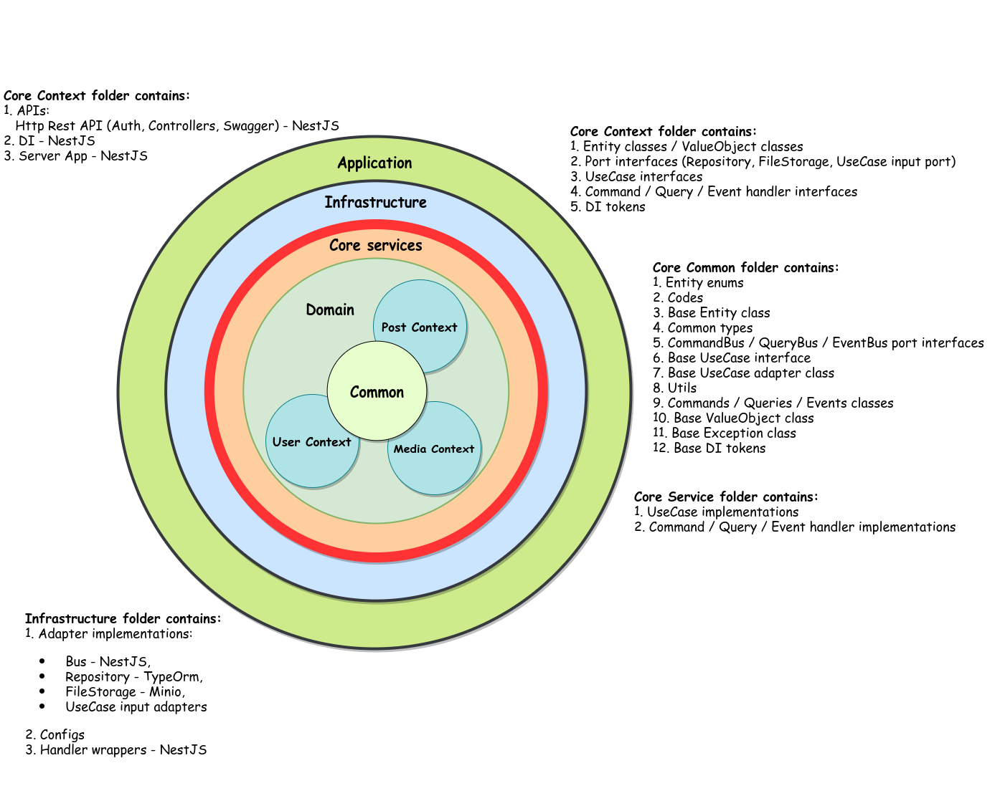
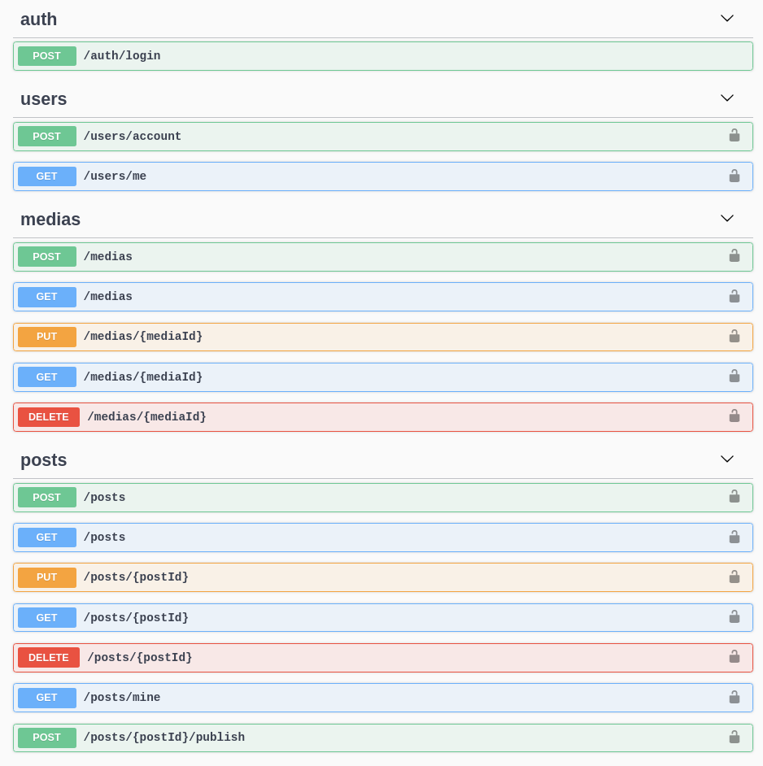

# Typescript Clean Architecture

It is my attempt to create Clean Architecture based application in Typescript.

 
    

## IPoster

IPoster is a simple fictional application that allows users to publish posts.

#### Main Entities
1. User
2. Post
3. Media

#### Use Cases

* User -> IPoster
  1. `User` can create `Guest` account in `IPoster`
  2. `User` can create `Author` account in `IPoster`

* User -> Media
  1. `Author` can create own `Media`
  2. `Author` can edit own `Media`
  3. `Author` can get own `Media`
  4. `Author` can get own `Media` list
  5. `Author` can remove own `Media`

* User -> Post
  1. `Author` can create own draft `Post`
  2. `Author` can edit own `Post`
  3. `Author` can attach an image `Media` to own `Post`
  4. `Author` can publish own `Post`
  5. `Author` can get own `Post`
  6. `Author` can get own `Post` list
  7. `Author` can remove own `Post`
  8. `Author` and `Guest` can get published `Post`
  9. `Author` and `Guest` can get list with published `Posts`
  
## Local Development

* **Docker**

    All necessary external services are described in the [./docker-compose.local.yml](./docker-compose.local.yaml):
    * Run `docker-compose -f docker-compose.local.yaml up -d`
    * Stop `docker-compose -f docker-compose.local.yaml stop`
    
    Services:
    1. PostgreSQL - [Credentials](./env/local.pg.env).
    2. Minio - [Credentials](./env/local.minio.env).
    
* **Building**

    1. Install libraries - `npm install`
    2. Build application - `npm run build`
    
* **Configuring**
  
    Configuring is based on the environment variables. All environment variables must be exposed before starting the application.
    See [all environment variables](./env/local.app.env).
    
* **Running**

    * Start application - `npm run start`
    * Expose [./env/local.app.env](./env/local.app.env) and start application - `npm run start:local`
    
       

         

           API documentation will be available on the endpoint <i>GET <a href="http://localhost:3005/documentation/" target="_blank" rel="noopener noreferrer">http://localhost:3005/documentation</a></i>
         

          
         
       

    
* **Linting**

    * `npm run lint`
    
* **Testing**

    * Run unit tests - `npm run test:unit`
    * Run unit tests with coverage - `npm run test:unit:cov`
    * Run unit tests in `watch` mode - `npm run test:unit:watch`    
    
* **Libraries checking**    
   
    * Show new libraries' versions - `npm run lib:check`
    * Upgrade libraries' versions - `npm run lib:upgrade`    

* **IDE configuring**
    * [Run application in the IntelliJ IDEA](./asset/IdeaApplicationLaunchConfiguration.png)
    * [Run unit tests in the IntelliJ IDEA](./asset/IdeaUnitTestConfiguration.png)
